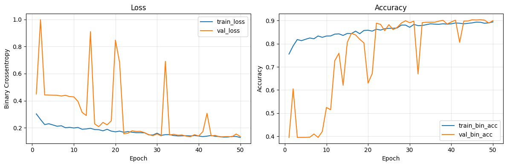
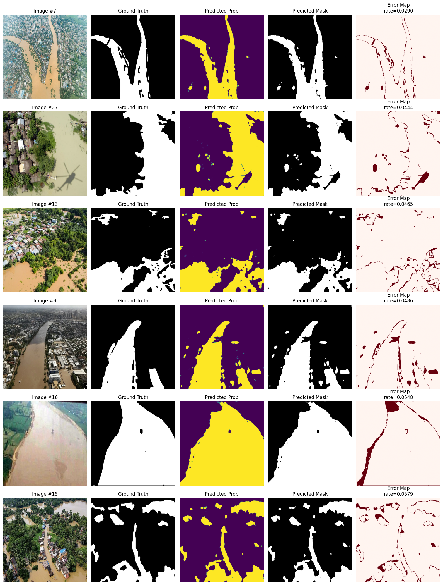
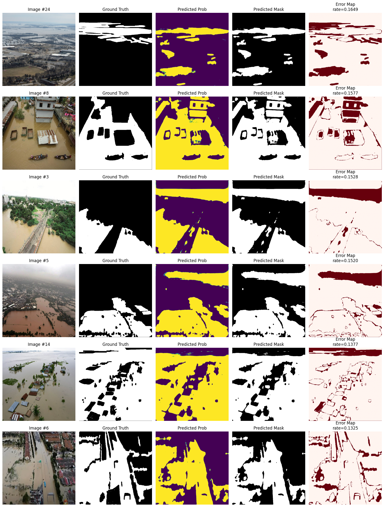

# Mini Project 8: Flood Area Segmentation

**COMP 9130 Applied AI — Group 8**  
Binger Yu & Michael Persson  
MSc Applied Computing, BCIT — March 6, 2026

---

## Problem Description

Floods are among the most destructive natural disasters, causing significant loss of life and infrastructure damage each year. Rapid, accurate flood mapping from aerial imagery is critical for emergency responders to prioritise rescue operations and allocate resources.

This project applies semantic segmentation to aerial and UAV imagery to automatically identify flooded regions at the pixel level. We train a **U-Net** model on the [Flood Area Segmentation dataset](https://www.kaggle.com/datasets/faizalkarim/flood-area-segmentation) to perform binary segmentation: **flood** vs. **background**.

---

## Dataset

| Property | Value |
|---|---|
| Source | Kaggle — Flood Area Segmentation (faizalkarim) |
| Total pairs | 290 image–mask pairs |
| Valid pairs (after QC) | 283 (7 discarded due to dimension mismatch) |
| Task | Binary segmentation (flood / background) |
| Image format | JPEG (RGB), variable resolution |
| Mask format | PNG (binary) |
| Split | 80 / 10 / 10 (train / val / test) |
| Training resolution | 640 × 640 px |

Images vary considerably in native resolution (e.g. 300×500 to 1425×1900 px) and are resized to 640×640 during loading. 7 pairs with mismatched image–mask spatial dimensions were discarded during preprocessing.

### Download the Dataset

The dataset is downloaded automatically via `kagglehub` when you run the notebook. You will need a Kaggle account and API credentials configured:

```bash
# Install kaggle CLI and set up credentials
pip install kaggle
mkdir -p ~/.kaggle
cp kaggle.json ~/.kaggle/
chmod 600 ~/.kaggle/kaggle.json
```

Alternatively, download manually from:  
👉 https://www.kaggle.com/datasets/faizalkarim/flood-area-segmentation

Place the dataset so the structure looks like:
```
flood-area-segmentation/
├── metadata.csv
├── Image/
│   ├── 0.jpg
│   ├── 1.jpg
│   └── ...
└── Mask/
    ├── 0.png
    ├── 1.png
    └── ...
```

---

## Repository Structure

```
├── data/                   # Dataset (not included in repo)
│   ├── Image/              # Image files           
│   ├── Mask/               # Mask files           
│   └── download_dataset.txt    
├── doc/        
├── figures/
│   ├── training.png        # Training/validation loss and accuracy curves
│   ├── best.png            # 6 best predictions with error maps
│   ├── worst.png           # 6 worst predictions with error maps
│   ├── predictions.png     # Sample validation predictions
│   └── sample.png          # Sample image–mask pair from dataset
├── notebooks/              # Jupyter notebooks (primary work)
│   └── MP_YU_Persson.ipynb # Main notebook: data loading 
├── requirements.txt        # Python dependencies
├── README.md
└── .gitignore
```

---

## Setup Instructions

### Requirements

- Python 3.10+
- TensorFlow 2.15+ (or `tensorflow-macos` + `tensorflow-metal` on Apple Silicon)
- GPU recommended (training at 640×640 takes ~92s/epoch on Apple M-series)

### Install Dependencies

```bash
pip install -r requirements.txt
```

**`requirements.txt`:**
```
tensorflow>=2.15
kagglehub
numpy
matplotlib
pandas
Pillow
```

> **Apple Silicon users:** Replace `tensorflow` with `tensorflow-macos` and `tensorflow-metal` for GPU acceleration.

---

## How to Run

### Training

Open and run `MP_Yu_Persson.ipynb` end-to-end in Jupyter or Google Colab.

The notebook will:
1. Download the dataset via `kagglehub`
2. Preprocess and validate all image–mask pairs
3. Build the U-Net model
4. Train for up to 50 epochs with EarlyStopping and ReduceLROnPlateau
5. Evaluate on the held-out test set
6. Generate and display all prediction visualizations

```bash
jupyter notebook MP_Yu_Persson.ipynb
```

Or open in **Google Colab** (recommended for GPU access if not on local GPU):  
Upload the notebook and run all cells in order.

### Key Training Parameters

| Parameter | Value |
|---|---|
| Image resolution | 640 × 640 |
| Batch size | 8 |
| Optimizer | AdamW, lr=1e-3 |
| Loss function | Dice loss |
| Max epochs | 50 |
| Early stopping patience | 9 (val_loss) |
| LR reduction factor | 0.5, patience=5 |

### Evaluation

Evaluation runs automatically at the end of the notebook. Metrics reported:
- Binary accuracy (`model.evaluate`)
- Per-image Dice, IoU, Precision, Recall (mean ± std)
- Pixel-level confusion matrix → per-class Dice, IoU, Precision, Recall
- Macro averages

---

## Results

### Best Epoch

| Metric | Value |
|---|---|
| Best epoch | 45 / 50 |
| val_loss (Dice) | 0.1335 |
| val_IoU | 0.7809 |
| val_accuracy | 90.35% |

### Test Set Metrics

| Class | Dice | IoU | Precision | Recall |
|---|---|---|---|---|
| Flood (foreground) | 0.8793 | 0.7846 | 0.8745 | 0.8841 |
| Background | 0.9264 | 0.8628 | 0.9295 | 0.9233 |
| **Macro average** | **0.9028** | **0.8237** | **0.9020** | **0.9037** |

**Per-image (flood) mean ± std:**  
Dice: 0.8551 ± 0.1036 | IoU: 0.7592 ± 0.1372 | Precision: 0.8608 ± 0.1344 | Recall: 0.8620 ± 0.0860

**Overall test accuracy:** 90.85% | **Test Dice loss:** 0.1203

### Training Curve



Training loss decreased smoothly from 0.3030 (epoch 1) to 0.1293 (epoch 50). Validation loss shows characteristic spikes due to the small validation set (~28 images), but the model converged well by epoch 45.

---

## Sample Predictions

### Best Predictions (lowest pixel error rate)



### Worst Predictions (highest pixel error rate)



Failure cases are concentrated at flood–background boundaries and in images with muddy or reflective floodwater that visually resembles non-flooded terrain.

---

## Team Contributions

| Member | Contributions |
|---|---|
| **Michael Persson** | Dataset exploration, data pipeline implementation, U-Net architecture, model training and evaluation, figure generation |
| **Bing Yu** | Results analysis, report writing, README documentation, GitHub repository organisation |

---

## References

1. O. Ronneberger, P. Fischer, and T. Brox, "U-Net: Convolutional Networks for Biomedical Image Segmentation," *MICCAI*, 2015. https://arxiv.org/abs/1505.04597  
2. F. Karim, "Flood Area Segmentation Dataset," Kaggle, 2022. https://www.kaggle.com/datasets/faizalkarim/flood-area-segmentation  
3. S. Jadon, "A Survey of Loss Functions for Semantic Segmentation," *IEEE CIBCB*, 2020. https://arxiv.org/abs/2006.14822  
4. M. Rahnemoonfar et al., "FloodNet: A High Resolution Aerial Imagery Dataset for Post Flood Scene Understanding," *IEEE Access*, vol. 9, 2021.
